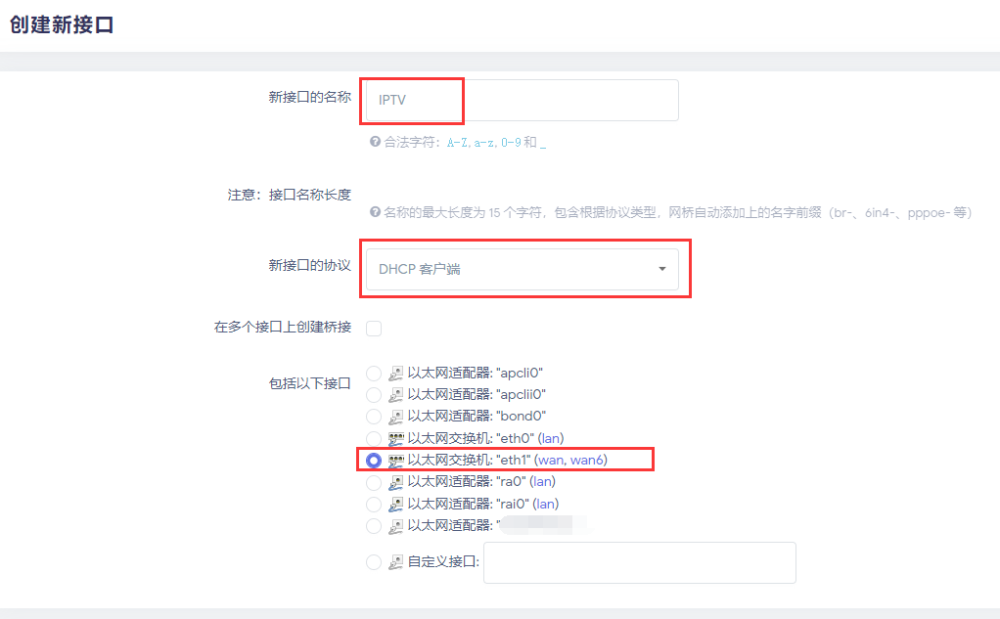
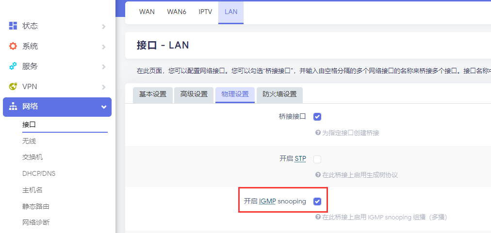
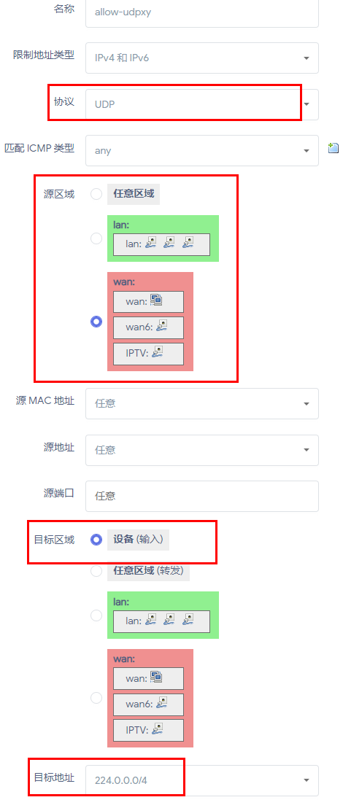
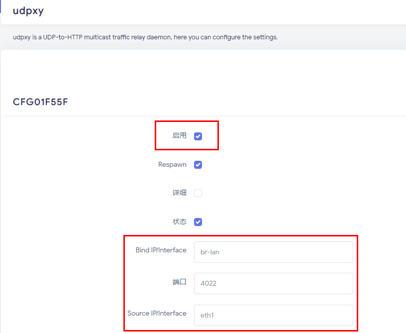
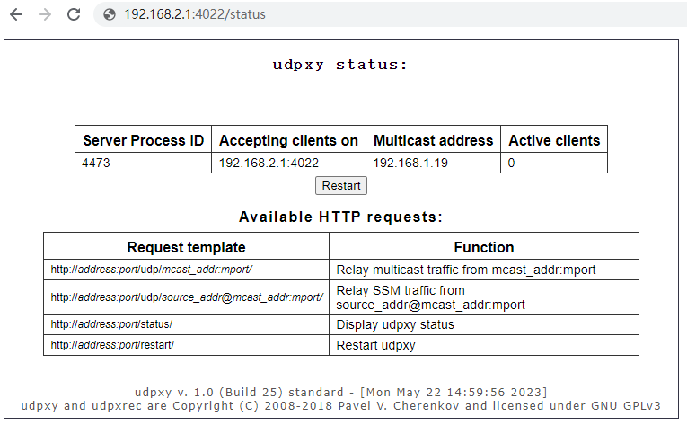

# udpxy-IPTV
udpxy+IPTV实现组播流量转单播

北京联通是没开通 IPTV 也能收到电视组播数据的。

本文就介绍如何白嫖北京联通 IPTV，并使任意设备可在家庭网络上流畅观看 IPTV 的直播流。

首先确定光猫是桥接模式。若不是，直接打客服电话要求改桥接。

确定网络结构如下所示：

1
光纤 —— 光猫 —— 路由器 —— 各种设备
然后，通过以下方式尝试验证是否能白嫖 IPTV：

1、将电脑通过有线连接到光猫的任意接口，然后和光猫处于同一网段（一般是 192.168.1.0/24）
2、用 ffplay 或者 vlc 打开 rtp://239.3.1.241:8000 尝试

若能看到直播画面，就说明 IPTV 能白嫖。

我的路由刷的 Openwrt 固件，这里就以 Openwrt 为例进行配置。

假设：

光猫网段为192.168.1.0/24，路由器网段为192.168.2.0/24
Openwrt 默认有 3 个接口，分别是LAN、WAN、WAN6；LAN 绑定 br-lan，WAN 绑定 eth1
1、安装软件包：

omcproxy
udpxy
luci-app-udpxy
2、在【网络-接口】中新建一个新接口「IPTV」

3、配置「IPTV」接口的网关跃点与防火墙设置

网关跃点：配置为 20（在接口的高级设置里）
防火墙：配置到 wan 上（在接口的防火墙设置里）
4、配置「WAN」接口的网关跃点为 10

5、打开「LAN」接口的 IGMP 嗅探

6、在【网络-防火墙-通信规则】中新建一个规则

7、配置并启动 udpxy 服务

8、打开 http://192.168.2.1:4022/status 验证 udpxy 是否启动成功

以上都设置好了后，将之前的 rtp://239.3.1.241:8000 改为 http://192.168.2.1:4022/rtp/239.3.1.241:8000 再看看是否能播放，能播放就说明大功告成了。

最后可以网上现成的「北京联通IPTV播放列表」：